# ProtoDeck

<p align="center">
  <strong>简体中文</strong> · <a href="README_EN.md">English</a>
</p>

[](https://github.com/thiscoalball/ProtoDeck/actions/workflows/build-platforms.yml)
[](LICENSE)

ProtoDeck 是一款面向网络工程师、后端与客户端开发者、路由器维护人员和设备调试人员的
本地优先网络与协议工作台。项目使用 Flutter 构建，在 Android、Windows 和 Linux 上共享
统一的工具模型，同时针对触控设备与桌面大屏采用不同的信息布局。

> 项目仍在积极开发。结果会受到操作系统权限、硬件能力、网络策略和外部服务可用性的影响。
> 不可用能力会显示真实原因与修复建议，不会用模拟设备、随机指标或示例扫描结果伪装成功。

## 界面预览

<p align="center">
  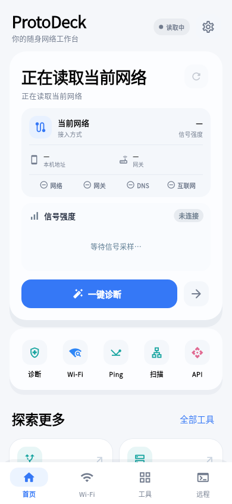
  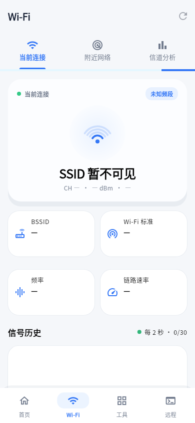
  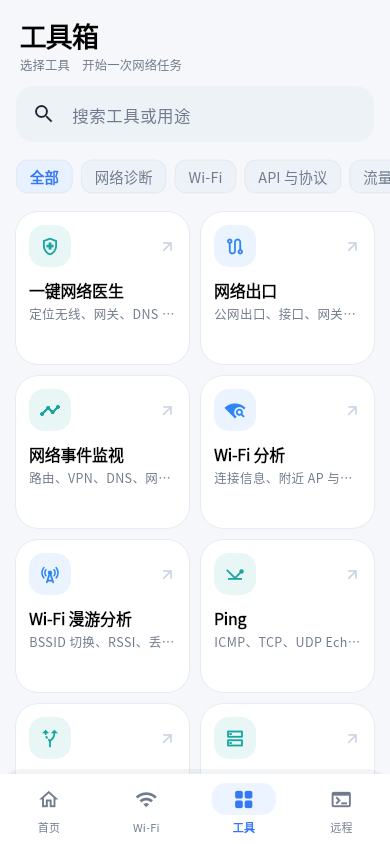
</p>
<p align="center">
  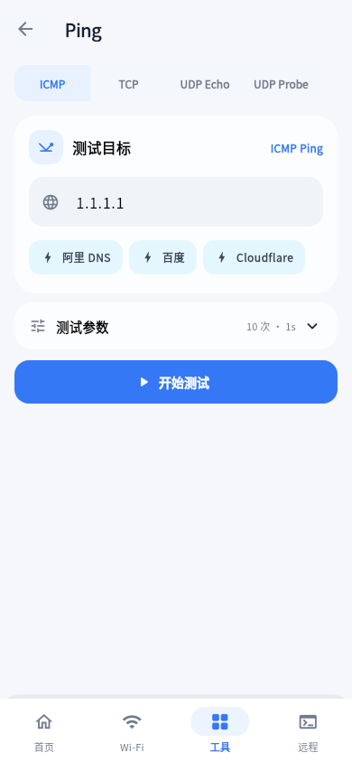
  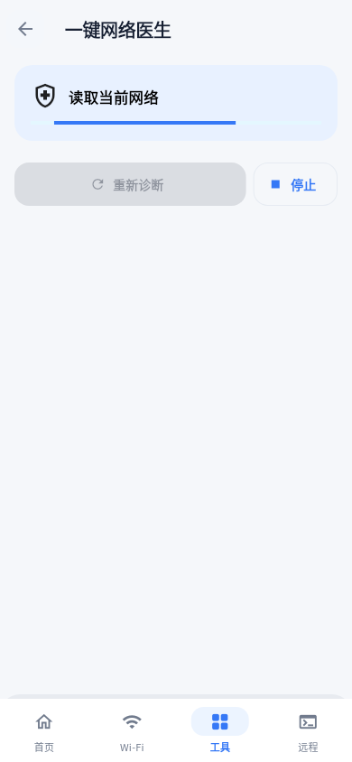
  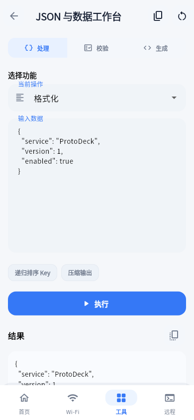
</p>
<p align="center">
  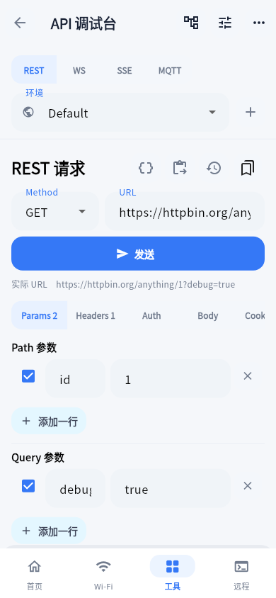
  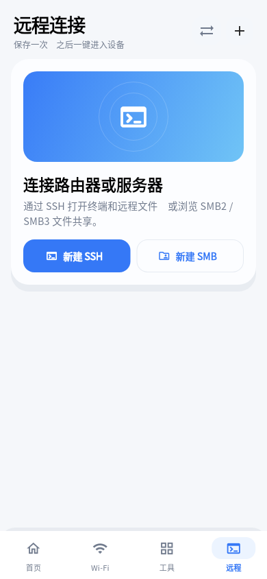
  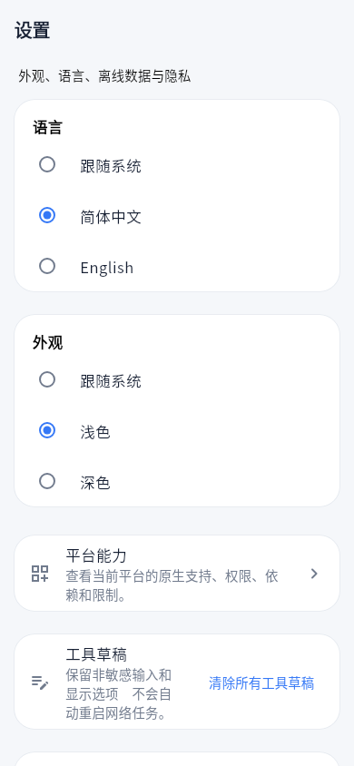
</p>

### 桌面布局

<p align="center">
  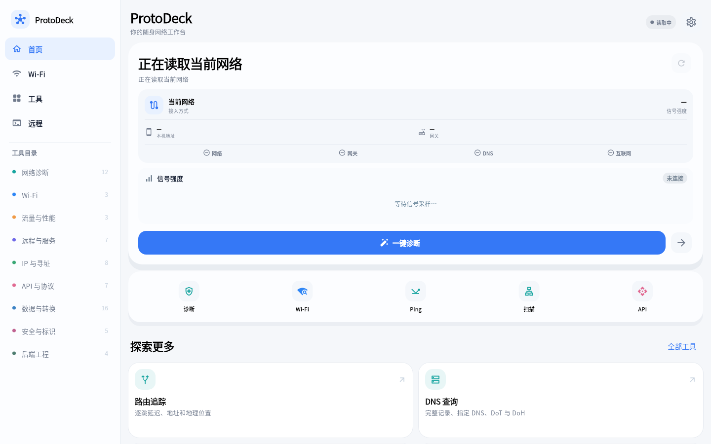
  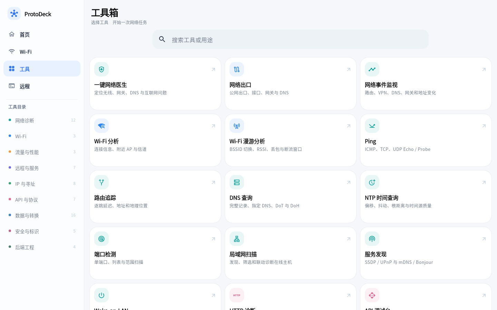
</p>
<p align="center">
  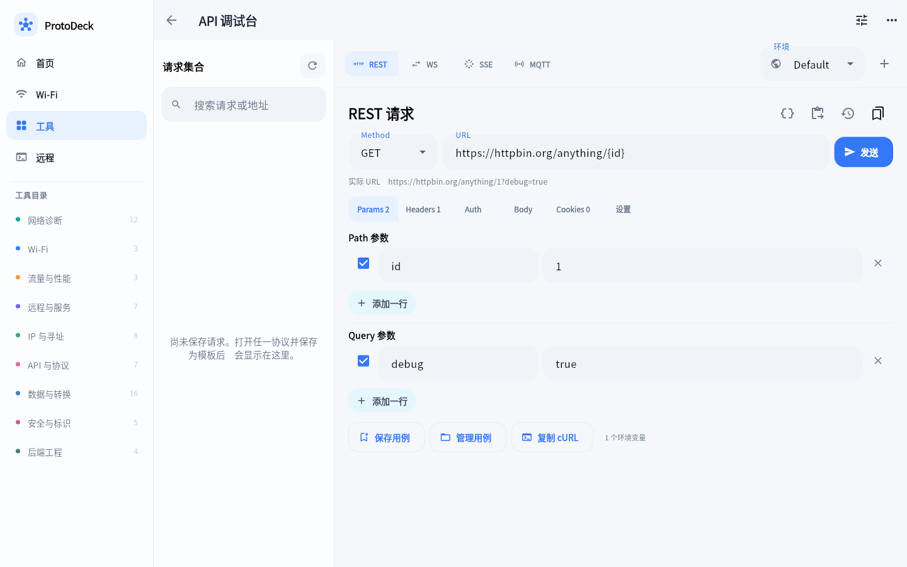
  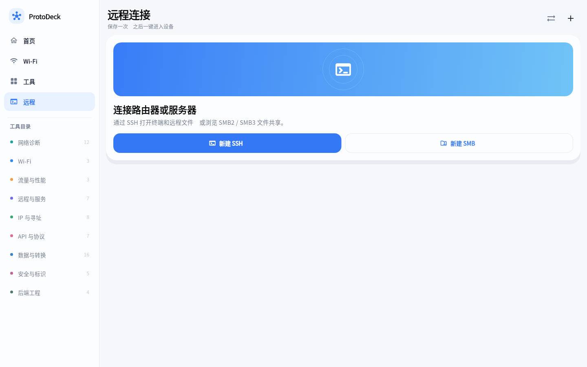
</p>

更多说明见[截图文档](docs/screenshots/README.md)。

## 产品特点

- **本地优先**：子网、编码、格式化、抓包解析和 IEEE OUI 查询等各类开发者功能。
- **多端平台能力**：Android 使用系统网络与蓝牙接口；Windows、Linux 使用各自的原生桥接
  和系统服务，不以固定常量填充缺失字段。
- **诊断链路完整**：从网络出口、Ping、DNS、Traceroute、MTU 到端口、TLS、HTTP、iPerf，
  工具之间可以携带目标地址继续排查。
- **专业结果展示**：时序曲线、汇总统计、协议层级、端点与会话、结构化 JSON/XML/HTML、
  Hex 和原始数据视图按场景提供。
- **安全的状态恢复**：非敏感输入、选项、过滤和排序会恢复；密码、Token、Cookie、私钥
  口令、终端输出和抓包内容不会写入普通草稿。
- **跨平台但不假装一致**：入口会依据平台显示可用、部分可用、需要权限、缺少依赖、需要
  提权或不支持，并提供重新检测和修复操作。

## 功能概览

当前工具目录包含 65 个入口，按使用场景划分为九类。每个入口还可能包含多个协议模式或
子页面，例如 Ping 的 ICMP/TCP/UDP、API 调试台的 REST/WebSocket/SSE/MQTT，以及蓝牙的
BLE 与经典蓝牙模式。

### Wi-Fi 与当前网络

- 当前默认出口、底层接口、VPN、网关、DNS、本地 IPv4/IPv6 和 MTU。
- Wi-Fi SSID/BSSID、频段、信道、频宽、标准、链路速率、RSSI 与信号历史。
- 附近 AP 搜索、频段筛选、信号/信道排序、信道占用柱状图和频宽强度图。
- 中国区域信道建议、可用频宽说明以及 2.4/5/6 GHz 分析。
- Wi-Fi 漫游事件、BSSID 切换、断流窗口、网关时延与丢包轨迹。
- Android 蜂窝网络制式和设备允许读取的 RSRP、RSRQ、SINR 等指标。

### 网络诊断

- 一键网络医生：分离检查接口、网关、DNS 与互联网端点，避免把“没有公网 IPv4”误判为
  “无法上网”。
- Ping：ICMPv4/IPv6、TCP、UDP Echo 和 UDP Probe，支持次数、持续运行、间隔、超时、
  数据大小、逐包结果、延迟曲线、抖动和丢包统计。
- Traceroute：逐跳探测、主机名、延迟统计与按跳号连接的地理概览。
- DNS：A、AAAA、CNAME、MX、TXT、NS、PTR，系统/UDP/TCP/DoT/DoH 和多解析器对比。
- NTP：多次采样、时钟偏移、往返延迟、抖动、Stratum、Leap Indicator、根距离和质量判断。
- 端口检测：列表/范围、IPv4/IPv6、并发与超时、Banner、状态筛选和 CSV 报告。
- LAN 扫描：TCP、SSDP、mDNS 组合发现，搜索排序、服务筛选及 Ping/SSH/HTTP/SMB 联动。
- 服务发现、Wake-on-LAN、路径 MTU 和 STUN 映射稳定性检测。

### 流量与性能

- iPerf 3.21 Client/Server，TCP/UDP、IPv4/IPv6、反向/双向、并行流、码率、实时终端输出
  和吞吐曲线。
- 实时接口上传/下载、活跃连接、TCP/UDP 分布、端点和可见进程归属。
- Android 应用流量统计，以及 Windows/Linux 普通模式下的 PID/Socket 归属。
- PCAP/PCAPNG 完全离线解析，包含数据包筛选、协议层级、I/O 曲线、端点排行、双向会话、
  应用层线索和 JSON/CSV 导出。

### 远程连接与本地服务

- SSH PTY 终端、ANSI 颜色、移动端特殊按键、多会话切换、主机密钥 TOFU 和安全凭据存储。
- SSH 连接后的 SFTP/SCP/Shell 文件浏览；SFTP 不可用时可回退到远端 Shell 文件面板。
- 文件上传、下载、删除、重命名、新建目录、chmod、冲突处理、传输进度和稳定排序。
- SSH Local/Remote/Dynamic SOCKS 隧道。
- SMB2/SMB3 文件共享、共享枚举和手工共享名。
- TCP/UDP 调试助手、Telnet、Syslog UDP/TCP 接收、SNMP v2c/v3 浏览与 Walk。
- 手机或电脑本机快速启动 HTTP、TCP Echo 等测试服务。
- BLE 扫描、广播数据、GATT 服务/特征读写与通知，以及平台允许的经典蓝牙能力。

### API 与协议调试

- REST 请求编辑、Query/Header/Cookie/Auth/Body、变量替换、请求模板、历史和 cURL 导入导出。
- JSON、XML、HTML、文本和二进制响应识别，代码/树形/原始/Hex 视图。
- 状态码、Header 和 JSONPath 断言，以及响应变量提取。
- WebSocket 连接、消息发送、收发记录和结构化消息展示。
- SSE 事件流解析与停止；MQTT 连接、订阅列表、发布、QoS 和消息日志。
- HTTP 耗时分段、重定向链、响应截断、安全响应头观察和 TLS 证书摘要。
- TLS 信任状态、有效期、ALPN、SHA-1/SHA-256 指纹和 PEM 复制。

### IP、寻址与离线数据库

- IPv4 子网网络地址、广播、首末主机、地址数量、通配符掩码及 `/0`、`/31`、`/32` 边界。
- IPv6 网络边界、精确 `BigInt` 地址数及前缀小于 `/64` 时的 `/64` 数量。
- IPv4/IPv6 特殊地址分类、五类嵌入转换、压缩/展开、`ip6.arpa` 和数值表示。
- RDAP/ASN、GeoIP 单条与批量查询、在线 Provider 配置和七日缓存。
- 内置 IEEE MA-L、MA-M、MA-S SQLite 数据库，最长前缀匹配、厂商反查和手动原子更新。
- MAC 多格式转换、EUI-64、地址属性和常用端口速查。

### 开发者与后端工具

- Base64、URL、Unicode、HTML Entity、Hexdump、Gzip、字节序、进制和位运算。
- 时间戳单位自动识别、IANA 时区、批量转换、时间差和多语言代码片段。
- 正则预设、示例文本、Flags、捕获组、替换预览、语法解释与风险提示。
- JSON/YAML/CSV 转换、JSONPath、递归排序、语义 Diff、实用 Schema 检查和模型生成。
- JSON/XML/YAML/SQL 格式化、文本行/词级 Diff。
- Hash/HMAC 多算法同时计算、逐项复制和流式文件 Hash。
- JWT 解码、Claims 风险检查及 HS256/384/512 签名验证。
- UUID/ULID/密码生成、分布式 ID 检查、chmod、Cron、SemVer、SQL、HTTP 元数据、日志分析和
  User-Agent 解析。

完整入口与内部设计见 [应用开发文档](app/README.md)。

## 平台支持

| 平台 | 支持级别 | 主要说明 |
|---|---|---|
| Android 10+ | 主要支持平台 | Wi-Fi、蜂窝、蓝牙、应用流量和前台任务以真机权限及厂商实现为准 |
| Windows 10/11 x64 | 支持 | 原生网卡/WLAN、WinRT BLE 扫描与 GATT Client、SSH/文件操作；RFCOMM 暂不可用 |
| Ubuntu 22.04/24.04 x64 | 支持 | 依赖 GTK3、BlueZ、NetworkManager 和 libsmbclient；部分命令依赖系统工具 |
| iOS | 实验性 | 保留工程骨架，不承诺与 Android 等价的系统网络、蓝牙和 iPerf 能力 |

详细到具体能力的矩阵、Linux 运行依赖和降级行为见
[平台支持文档](docs/platform-support.md)。

## 仓库结构

```text
app/                  Flutter 应用、平台桥接、测试与构建脚本
docs/                 架构、权限、平台支持和自动截图文档
.github/workflows/    Android、Windows、Linux 自动构建
.github/scripts/      CI 版本解析与辅助脚本
```

进一步阅读：

- [架构说明](docs/architecture.md)
- [平台支持](docs/platform-support.md)
- [应用开发文档](app/README.md)
- [第三方组件与数据](THIRD_PARTY_NOTICES.md)


## 参与贡献

提交代码前请阅读 [CONTRIBUTING.md](CONTRIBUTING.md) 和
[CODE_OF_CONDUCT.md](CODE_OF_CONDUCT.md)。Bug、兼容性问题与功能建议请使用结构化 Issue
模板；安全问题不要创建公开 Issue，请按照 [SECURITY.md](SECURITY.md) 联系维护者。

## 第三方组件与许可证

项目包含或调用 iPerf、Cygwin、Droid Sans Fallback、SMBJ、IEEE Registration Authority
公开数据及若干 Flutter/Dart 依赖。完整来源、固定版本、源码归档说明和许可证入口见
[THIRD_PARTY_NOTICES.md](THIRD_PARTY_NOTICES.md)。

ProtoDeck 自有代码采用 [Apache License 2.0](LICENSE)；第三方组件与数据继续遵循各自的
许可证和使用条款。
