# ProtoDeck

<p align="center">
  <a href="README.md">简体中文</a> · <strong>English</strong>
</p>

[](https://github.com/thiscoalball/ProtoDeck/actions/workflows/build-platforms.yml)
[](LICENSE)

ProtoDeck is a local-first network and protocol workbench for network
engineers, backend and client developers, router maintainers, and device
debugging professionals. It is built with Flutter and shares one tool model
across Android, Windows, and Linux, with layouts tailored for touch devices and
large desktop screens.

> ProtoDeck is under active development. Results depend on operating-system
> permissions, hardware, network policy, and external service availability.
> Unavailable capabilities report their actual reason and recovery guidance;
> the app never substitutes mock devices, random metrics, or fake scan results.

## UI previews

<p align="center">
  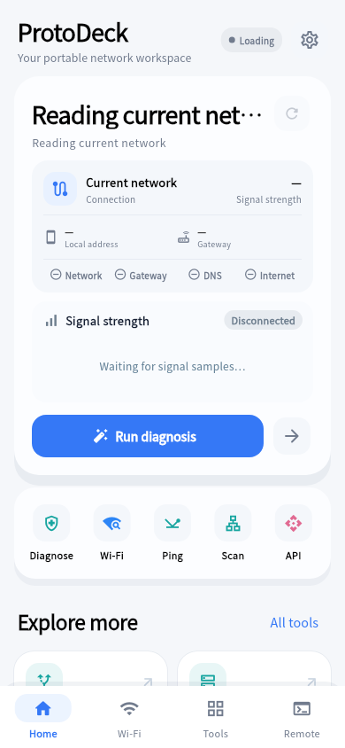
  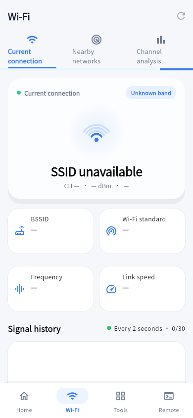
  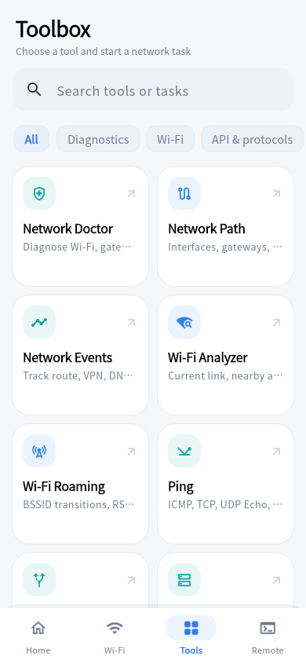
</p>
<p align="center">
  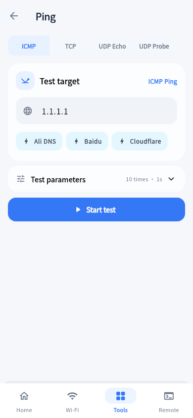
  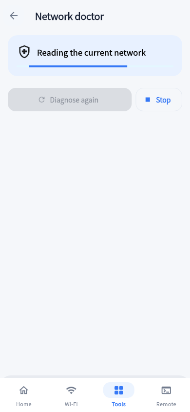
  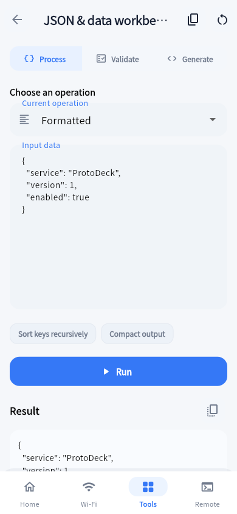
</p>
<p align="center">
  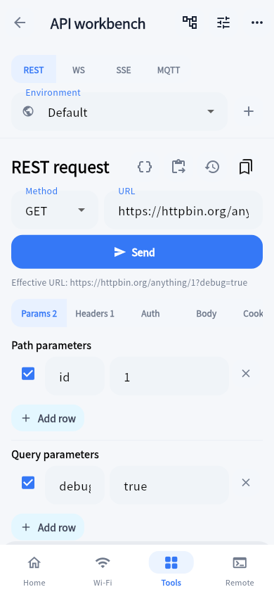
  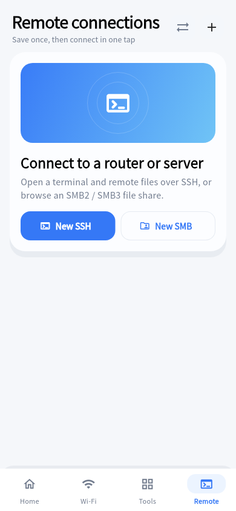
  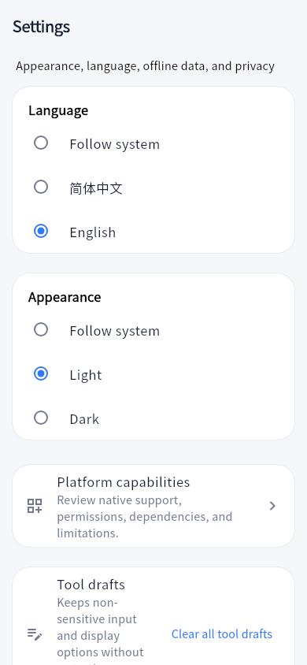
</p>

### Desktop layout

<p align="center">
  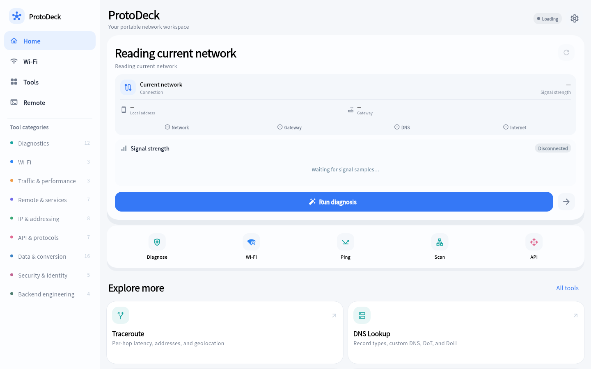
  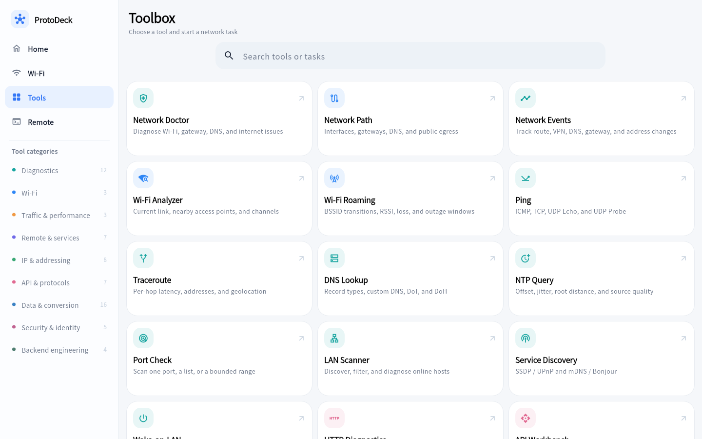
</p>
<p align="center">
  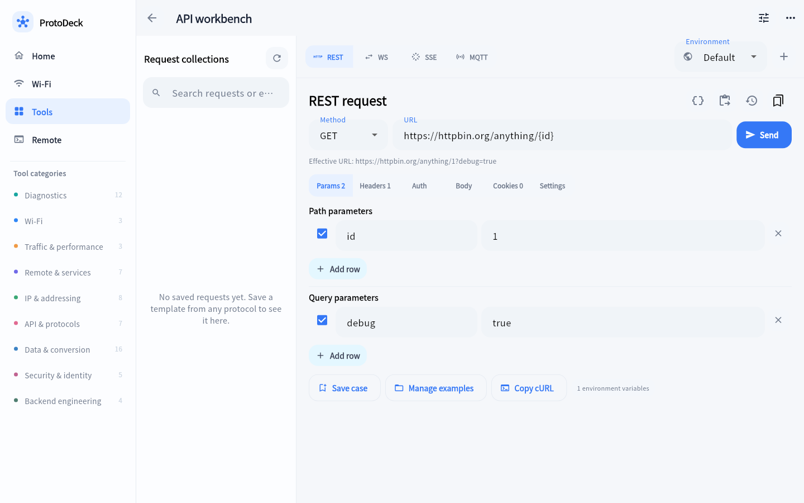
  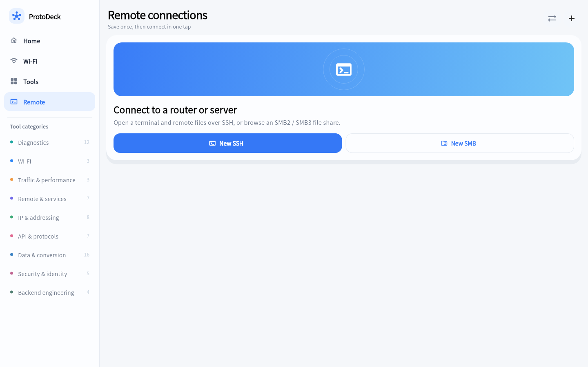
</p>

The images are generated by Flutter screenshot tests and contain no personal
account, remote-host, or real scan data. Desktop images demonstrate the
responsive cross-platform layout; they are not presented as native Windows
runtime verification. See the [screenshot documentation](docs/screenshots/README.md).

## Highlights

- **Local first:** subnet, encoding, formatting, packet analysis, IEEE OUI
  lookup, and many developer utilities work locally.
- **Real platform capabilities:** Android uses system networking and Bluetooth
  APIs; Windows and Linux use their corresponding native bridges and services.
- **End-to-end diagnostics:** move from network path, Ping, DNS, Traceroute,
  and MTU to ports, TLS, HTTP, and iPerf while carrying the target between tools.
- **Professional output:** time-series charts, aggregate statistics, protocol
  hierarchies, endpoints, sessions, structured JSON/XML/HTML, Hex, and raw views.
- **Safe state restoration:** non-sensitive inputs, filters, and sort options
  can be restored; passwords, tokens, cookies, private-key passphrases,
  terminal output, and captures are excluded from ordinary drafts.
- **Honest cross-platform behavior:** entries show available, partially
  available, permission required, dependency required, elevation required, or
  unsupported states instead of pretending all platforms are identical.

## Feature overview

The catalog currently contains 65 entries grouped into nine categories. One
entry may expose several protocol modes—for example ICMP/TCP/UDP Ping,
REST/WebSocket/SSE/MQTT in the API Workbench, or BLE and Classic Bluetooth.

### Wi-Fi and current network

- Default egress, underlying interface, VPN, gateway, DNS, local IPv4/IPv6, and MTU.
- Wi-Fi SSID/BSSID, band, channel, width, standard, link rate, RSSI, and signal history.
- Nearby AP search, band filters, signal/channel sorting, channel occupancy,
  and bandwidth-strength charts.
- China-region channel recommendations, allowed bandwidth, and 2.4/5/6 GHz analysis.
- Wi-Fi roaming events, BSSID transitions, outage windows, gateway latency, and loss.
- Android cellular radio technology and available RSRP, RSRQ, SINR, and related metrics.

### Network diagnostics

- Layered network doctor for interface, gateway, DNS, and internet endpoints;
  the absence of public IPv4 is not treated as loss of internet access.
- ICMPv4/IPv6, TCP, UDP Echo, and UDP Probe with count/continuous modes,
  interval, timeout, payload, per-packet output, latency chart, jitter, and loss.
- Traceroute with per-hop probes, hostnames, latency, and ordered geographic overview.
- A, AAAA, CNAME, MX, TXT, NS, and PTR lookups via system, UDP, TCP, DoT, and DoH.
- NTP sampling, offset, RTT, jitter, Stratum, leap indicator, root distance, and quality.
- Port checks, LAN discovery, SSDP/UPnP, mDNS/Bonjour, Wake-on-LAN, Path MTU, and STUN.

### Traffic and performance

- Bundled iPerf 3.21 client/server with TCP/UDP, IPv4/IPv6, reverse/bidirectional,
  parallel streams, bitrate, live terminal output, and throughput charts.
- Live interface upload/download, active connections, TCP/UDP distribution,
  endpoints, and visible process attribution.
- Android application traffic and Windows/Linux PID/socket attribution in normal mode.
- Offline PCAP/PCAPNG parsing with filters, protocol hierarchy, I/O charts,
  endpoint rankings, bidirectional flows, application hints, and JSON/CSV export.

### Remote access and local services

- SSH PTY terminal, ANSI colors, mobile special keys, multiple active sessions,
  TOFU host keys, secure credentials, and Local/Remote/Dynamic SOCKS tunnels.
- SFTP/SCP/Shell file browsing with upload, download, rename, delete, mkdir,
  chmod, conflict handling, progress, and stable name/size/time sorting.
- SMB2/SMB3 browsing and transfer, TCP/UDP debugger, Telnet, Syslog receiver,
  SNMP v2c/v3 browser and Walk, and local HTTP/TCP Echo services.
- BLE scanning, advertising data, GATT service/characteristic read/write and
  notifications, plus platform-gated Classic Bluetooth features.

### API and protocol debugging

- REST Query/Header/Cookie/Auth/Body editing, variables, templates, history,
  and cURL import/export.
- JSON, XML, HTML, text, and binary response detection with code, tree, raw, and Hex views.
- Status, Header, and JSONPath assertions plus response-value extraction.
- WebSocket send/receive history, SSE event streams, and MQTT subscriptions,
  publish, QoS, and message logs.
- HTTP timing, redirects, truncation, security headers, and TLS summaries;
  certificate trust, expiry, ALPN, SHA-1/SHA-256 fingerprints, and PEM copy.

### IP, addressing, and offline data

- IPv4/IPv6 subnet boundaries and counts, wildcard masks, and `/0`, `/31`, `/32` handling.
- Special-address classification, embedded IPv4/IPv6 formats, compression,
  expansion, `ip6.arpa`, and numeric representations.
- RDAP/ASN, single and batch GeoIP, configurable providers, and a seven-day cache.
- Bundled IEEE MA-L/MA-M/MA-S SQLite database with longest-prefix matching,
  vendor reverse lookup, and manual atomic updates.
- MAC formatting, EUI-64 properties, and common-port reference.

### Developer and backend utilities

- Base64, URL, Unicode, HTML entities, Hexdump, Gzip, endian, radix, and bit operations.
- Timestamp unit detection, IANA time zones, batch conversion, arithmetic, and code snippets.
- Regex presets, examples, flags, capture groups, replacement preview, and risk hints.
- JSON/YAML/CSV conversion, JSONPath, recursive sort, semantic Diff,
  pragmatic schema checks, and model generation.
- JSON/XML/YAML/SQL formatting; line/word Diff; multi-algorithm Hash/HMAC and file hashing.
- JWT, UUID/ULID/password generation, distributed ID inspection, chmod, Cron,
  SemVer, SQL, HTTP metadata, log inspection, and User-Agent parsing.

See the [application development guide](app/README_EN.md) for the complete
catalog, architecture, platform boundaries, and build commands.

## Platform support

| Platform | Level | Notes |
|---|---|---|
| Android 10+ | Primary | Wi-Fi, cellular, Bluetooth, app traffic, and foreground tasks depend on device permissions and vendor behavior |
| Windows 10/11 x64 | Supported | Native adapters/WLAN, WinRT BLE scan and GATT Client, SSH/file operations; RFCOMM is currently unavailable |
| Ubuntu 22.04/24.04 x64 | Supported | Requires GTK3, BlueZ, NetworkManager, and libsmbclient; some tools use system commands |
| iOS | Experimental | Project skeleton retained; Android-equivalent networking, Bluetooth, and iPerf are not promised |

See [platform support](docs/platform-support.md) for the capability matrix,
Linux dependencies, and fallback behavior.

## Repository layout

```text
app/                  Flutter app, platform bridges, tests, and build scripts
docs/                 Architecture, permissions, platform, and screenshot docs
.github/workflows/    Android, Windows, and Linux CI builds
.github/scripts/      CI version resolution and helper scripts
```

Further reading:

- [Architecture](docs/architecture.md)
- [Platform support](docs/platform-support.md)
- [Application development guide](app/README_EN.md)
- [Third-party components and data](THIRD_PARTY_NOTICES.md)

## Contributing

Read [CONTRIBUTING.md](CONTRIBUTING.md) and
[CODE_OF_CONDUCT.md](CODE_OF_CONDUCT.md) before submitting changes. Use the
structured issue templates for bugs, compatibility reports, and feature
requests. Do not open a public issue for a security vulnerability; follow
[SECURITY.md](SECURITY.md) instead.

## Third-party software and licenses

ProtoDeck includes or invokes iPerf, Cygwin, Droid Sans Fallback, SMBJ, IEEE
Registration Authority public data, and Flutter/Dart dependencies. Sources,
pinned versions, source-archive information, and license links are documented
in [THIRD_PARTY_NOTICES.md](THIRD_PARTY_NOTICES.md).

ProtoDeck-owned code is licensed under the [Apache License 2.0](LICENSE).
Third-party software and data remain subject to their respective terms.
